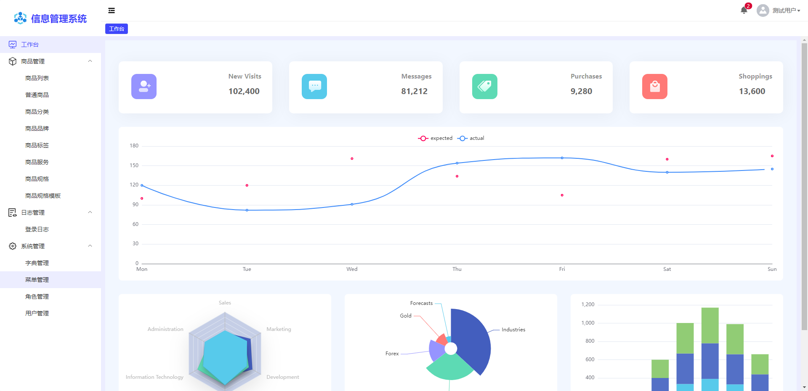
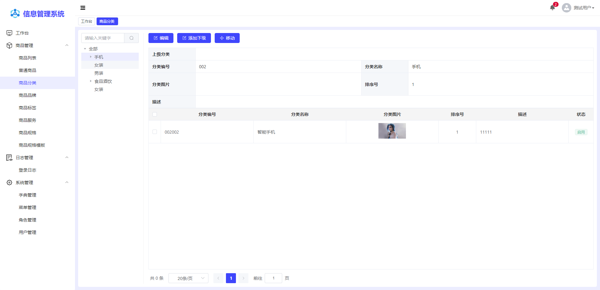
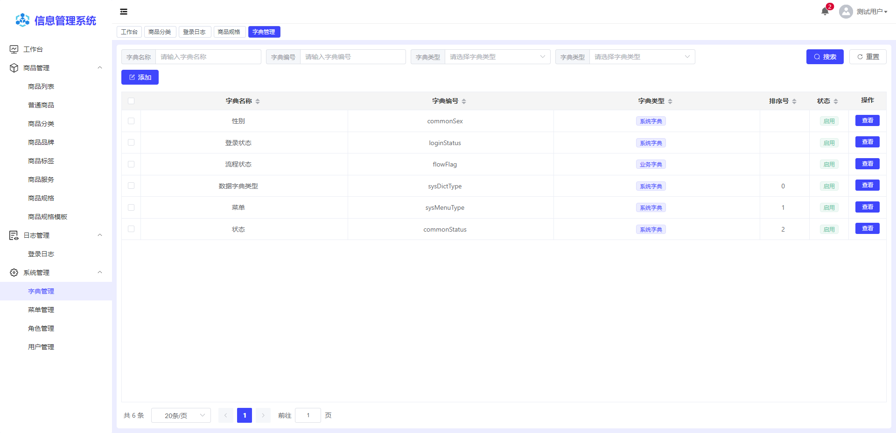

## 简介

项目的基础版本出自于源[vue3-composition-admin](https://github.com/RainManGO/vue3-composition-admin)。
后端采用.net6 webapi。

## 特性

- **Vue3**：采用 Vue3 + script setup 最新的 Vue3 组合式 API
- **Element Plus**：Element UI 的 Vue3 版本
- **Pinia**: 传说中的 Vuex5
- **Vite**：真的很快
- **Vue Router4**：路由
- **TypeScript**：JavaScript 语言的超集
- **Scss**：和 Element Plus 保持一致
- **CSS 变量**：主要控制项目的布局和颜色
- **ESlint**：代码校验
- **Prettier**：代码格式化
- **Axios**：发送网络请求（已封装好）

## 常用组件

- **filter**：查询条件，根据屏幕分辨率显示不同个数，超出显示更多筛选
- **table**：数据表格，高度自适应，可排序、可筛选、可分页
- **dynamic-table**：动态表格，支持添加、删除、清空行
- **notify**：通知消息，基于微软signalR封装
- **dialog**：弹窗，已封装，使用更便捷
- **tinymce**：富文本编辑器，基于tinymce封装
- **upload**：上传组件
- **upload-image**：上传图片组件，可以单图/多图，基于upload组件

## 预览

- [vue3-admin-elementPlus-template](https://erp.hontmall.com:2208/) - 完整版中文站点

## 项目预览图

## License

[MIT](./LICENSE)

Copyright (c) 2021-present 